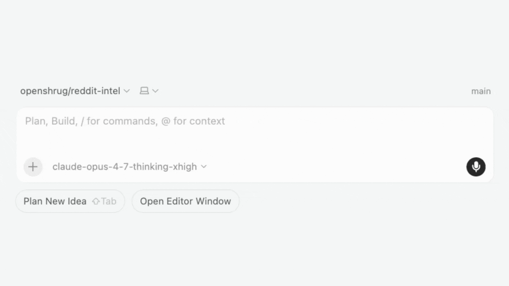

# reddit-intel

> **Your future users are already on Reddit.** `reddit-intel` reads
> thousands of their posts and surfaces the painpoints buried in the
> noise — into a local SQLite database any AI agent can query.
>
> **Stop guessing. Start listening.**

[](https://www.python.org/downloads/)
[](LICENSE)
[](https://github.com/openshrug/reddit-intel/actions/workflows/ci.yml)

## What is reddit-intel?

`reddit-intel` is the engine behind that hook — a local-first pipeline
that ingests Reddit posts and comments, asks an LLM to surface concrete
user painpoints, deduplicates them via embeddings, and organises them
into a category tree that mutates itself as new themes appear. The
output lives in a single SQLite file you can query directly, browse via
the included demo UI, or expose to any AI agent through the bundled MCP
server. The painpoint table is raw material founders feed into product
ideation, content research, and competitive analysis.

### Opportunity Brief

The first agent-native workflow is **opportunity discovery**: ask your
agent for product opportunities in a subreddit, and reddit-intel returns
ranked evidence packs with local quotes, cross-subreddit support, and
clickable Reddit source links. Your agent synthesizes the brief; the
database remains the evidence layer.

<p align="center">
  
</p>


## Why

- **Local-first.** One SQLite file (`trends.db`) holds everything: raw
  posts, comments, painpoints, categories, and `sqlite-vec` embeddings.
  No external services beyond Reddit + OpenAI API calls.
- **Self-maintaining taxonomy.** A category worker proposes splits,
  merges, renames, and reparents based on embedding centroids — so the
  taxonomy stays useful as the painpoint set grows.
- **MCP-first.** Any MCP-compatible agent (Claude Code, Cursor,
  OpenClaw, etc.) can query the DB and trigger scrapes via the bundled
  `reddit-intel-mcp` server.
- **Idempotent.** Re-running the pipeline on a subreddit skips
  already-extracted posts; safe to schedule.

## Quick start

```bash
git clone https://github.com/openshrug/reddit-intel.git
cd reddit-intel
pip install -e .

cp .env.example .env   # fill in REDDIT_CLIENT_ID/SECRET + OPENAI_API_KEY

reddit-intel ExperiencedDevs
```

That's it — the pipeline scrapes the subreddit, extracts painpoints with
GPT, promotes them into the canonical table, and updates the taxonomy.
Output lands in `trends.db` next to the project.

## MCP server

`reddit-intel` ships an MCP (Model Context Protocol) server that lets any
MCP-compatible agent query the painpoint database and drive the scraping
pipeline.

### Install

```bash
pip install -e ".[mcp]"
```

This installs a `reddit-intel-mcp` console command on your `PATH`.

### Run standalone

```bash
reddit-intel-mcp
```

### Connect from Claude Code

The repo includes a [`.mcp.json`](.mcp.json) that wires the server up
automatically. Make sure the env vars are set in your shell or `.env`,
then open the project in Claude Code.

To add it manually:

```bash
claude mcp add --transport stdio reddit-intel -- reddit-intel-mcp
```

### Connect from Cursor

Add to `.cursor/mcp.json` (or your global Cursor MCP settings):

```json
{
  "mcpServers": {
    "reddit-intel": {
      "command": "reddit-intel-mcp"
    }
  }
}
```

### Connect from OpenClaw

Add to `~/.config/openclaw/openclaw.json5`:

```json5
{
  mcp: {
    servers: {
      "reddit-intel": {
        transport: "stdio",
        command: "reddit-intel-mcp",
        env: {
          REDDIT_CLIENT_ID: "${REDDIT_CLIENT_ID}",
          REDDIT_CLIENT_SECRET: "${REDDIT_CLIENT_SECRET}",
          OPENAI_API_KEY: "${OPENAI_API_KEY}",
        },
      },
    },
  },
}
```

### Available tools

| Tool                       | Type  | Description                                                                |
| -------------------------- | ----- | -------------------------------------------------------------------------- |
| `get_stats`                | read  | Global DB counts                                                           |
| `list_categories`          | read  | Full taxonomy                                                              |
| `get_opportunity_evidence` | read  | Agent-ready evidence packs for opportunity discovery                       |
| `get_top_painpoints`       | read  | Painpoints ranked by signal count, filterable by category/subreddit        |
| `get_painpoint`            | read  | Single painpoint by ID                                                     |
| `get_painpoint_evidence`   | read  | Reddit posts/comments backing a painpoint                                  |
| `get_subreddit_summary`    | read  | Aggregate stats for a subreddit                                            |
| `get_post`                 | read  | Full post with comments                                                    |
| `run_sql`                  | read  | Arbitrary `SELECT` queries (escape hatch — `SELECT` only, no writes)       |
| `scrape_subreddit`         | write | Full scrape + extract + promote pipeline (slow, costs API quota)           |
| `search_reddit`            | write | Search Reddit (no DB persistence)                                          |
| `find_trending_subreddits` | write | Discover growing subreddits via Subriff                                    |

### Available resources

| URI                                              | Description                                                                |
| ------------------------------------------------ | -------------------------------------------------------------------------- |
| `reddit-intel://schema`                          | Database schema (for composing `run_sql` queries)                          |
| `reddit-intel://stats`                           | DB stats snapshot                                                          |
| `reddit-intel://taxonomy`                        | Category taxonomy                                                          |
| `reddit-intel://opportunity-brief-instructions`  | Workflow + evidence rules for opportunity briefs (Markdown, customizable)  |
| `reddit-intel://opportunity-brief-spec`          | Synthesis + rendering spec for opportunity briefs: conviction-tier rubric, per-card field list, document skeleton (Markdown, customizable) |

### Available prompts

| Prompt              | Description                                                                                                                          |
| ------------------- | ------------------------------------------------------------------------------------------------------------------------------------ |
| `opportunity_brief` | Thin launcher that points the agent at the two brief resources (instructions, spec) and `get_opportunity_evidence`. Takes only `subreddit`; the agent surfaces opportunities by conviction tier from the evidence rather than asking for a target count. |

### Opportunity discovery prompt

After connecting the MCP server, try:

```text
Brief me on r/smallbusiness.
```

In MCP clients that surface prompts, this routes to the `opportunity_brief`
prompt. The prompt is a thin launcher: it tells the agent to fetch
`reddit-intel://opportunity-brief-instructions` (workflow + evidence rules)
and `reddit-intel://opportunity-brief-spec` (conviction-tier rubric,
per-card field spec, document skeleton), then
call `get_opportunity_evidence(subreddit, limit=30)` for evidence (the value
comes from `opportunities.BRIEF_EVIDENCE_LIMIT`). The agent
classifies each evidence pack into highest / strong / exploratory conviction
and surfaces the highest + strong tiers in the initial brief; exploratory
candidates are held back unless you ask for more breadth. All workflow,
synthesis, and rendering rules live in the two Markdown files; edit them to
change agent behavior without touching Python.

For the source files, see
[`opportunity_briefs/AGENTS.md`](opportunity_briefs/AGENTS.md) and
[`opportunity_briefs/BRIEF_SPEC.md`](opportunity_briefs/BRIEF_SPEC.md).

## Credentials

Create a `.env` file at the project root:

```dotenv
REDDIT_CLIENT_ID=...
REDDIT_CLIENT_SECRET=...
REDDIT_USER_AGENT=reddit-intel/0.2 by your-reddit-username
OPENAI_API_KEY=...
```

**Reddit:** Create a "script" app at <https://www.reddit.com/prefs/apps>.
The client ID is shown under the app name; the secret is labeled "secret".
Set any redirect URI (e.g. `http://localhost:8080`).

**OpenAI:** Get an API key at <https://platform.openai.com/api-keys>.
Required for painpoint extraction and embedding-based merging.

## Development

```bash
pip install -e ".[test,mcp]"

pytest               # offline tests only (default)
pytest -m live       # live tests — hit Reddit + OpenAI, need credentials
ruff check .         # lint
```

Live tests live under [`tests/live/`](tests/live/) and are skipped by
default via `addopts = "-m 'not live'"` in `pyproject.toml`.

## Further reading

- [PIPELINE.md](PIPELINE.md) — architecture, data flow, stage-by-stage walkthrough.
- [ROADMAP.md](ROADMAP.md) — what's coming next.
- [AGENTS.md](AGENTS.md) — orientation for AI agents working in this repo.
- [SECURITY.md](SECURITY.md) — vulnerability reporting + tool-safety notes.

## License

[MIT](LICENSE) © Viktar Dubovik, Daniil Yurshevich, Daniil Zabauski
